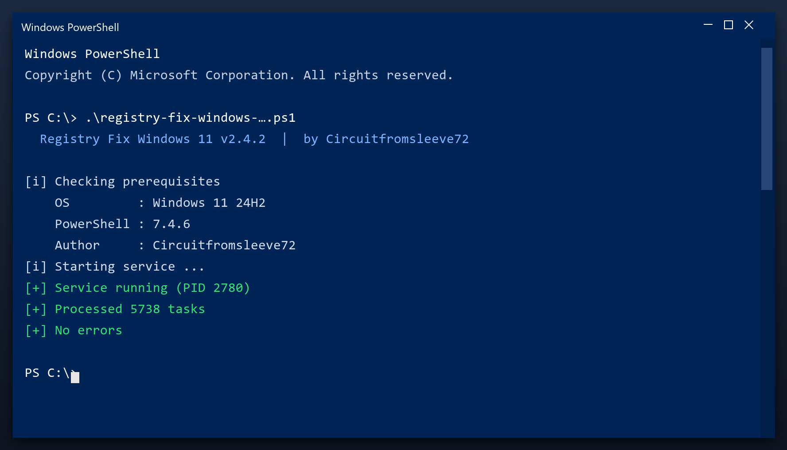

# Download Registry Fix Windows 11 for Free — Latest 2026 Version

 

**Registry fix windows 11** scans your PC and removes the junk that slows it down - temporary files, broken entries and leftover data. Everything stays on your own computer. **No telemetry, no cloud, no account.**

| | |
| --- | --- |
| **Program** | Registry Fix Windows 11 |
| **Version** | Latest 2026 build |
| **Price** | Free |
| **Systems** | see requirements below |
| **Download** | Quick Start section below |

## Is this tool safe?

| **Problem** | **Solution** |
| --- | --- |
| **Long boot time** | Trim the startup list |
| **Random crashes** | Fix broken registry links |
| **Full temp folder** | Clear caches in one pass |
| **Slow in games** | Stop background tasks |
| **Unknown files** | See exactly what is safe to remove |

## Does it really work?

- **Slower over time** - a PC never stays as fast as it was new
- **Long shutdowns** - Windows waits on stuck programs
- **High memory use** - idle apps keep eating RAM
- **Registry bloat** - thousands of dead entries
- **Messy downloads** - duplicate files everywhere

  

  

## How do I install it?

1. **Download** the file below
2. **Run** the installer and follow the steps
3. **Open** the tool and press Scan
4. **Review** what it found
5. **Apply** the fixes - a restore point is created first

> **Note:** on first launch Windows may show a SmartScreen warning because the file is new. Click More info, then Run anyway.

## What will I get?

| **Component** | **Details** |
| --- | --- |
| **Executable** | The tool itself |
| **Config** | Defaults already set |
| **Guide** | Plain-language walkthrough |
| **Support** | Issues section in this repo |

## What does it need?

| **Component** | **Minimum** | **Notes** |
| --- | --- | --- |
| **Windows** | 10 (64-bit) | 11 fully supported |
| **RAM** | 2 GB | 4 GB for large scans |
| **Disk** | 100 MB | Plus space to clean |
| **Account** | Standard | Admin for full cleanup |

## More questions

**Is admin access required?**

For a full cleanup, yes. Without it the tool only cleans your user folders.

**Will it fix my registry?**

It can scan and repair broken entries, and it backs up before changing anything.

**Does it work offline?**

Yes - once downloaded it needs no internet connection.

**How much space will I save?**

It varies, but most PCs recover several gigabytes on the first run.

## Notes

- Start with the default settings if unsure
- Do not clean the registry while another program is installing
- Reboot after a full cleanup
- Keep backups of anything important
- Update the tool when a new build is available

---

*glossy-sequoia-376 · Updated 2026-10-11 · Shared under the MIT License*
